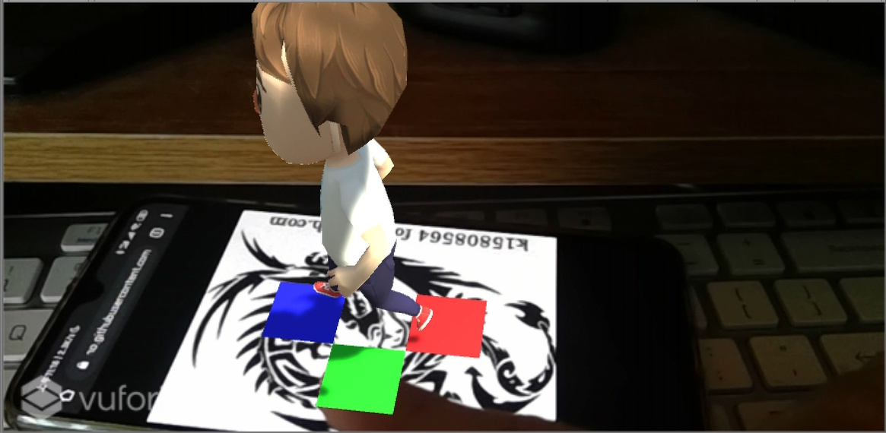
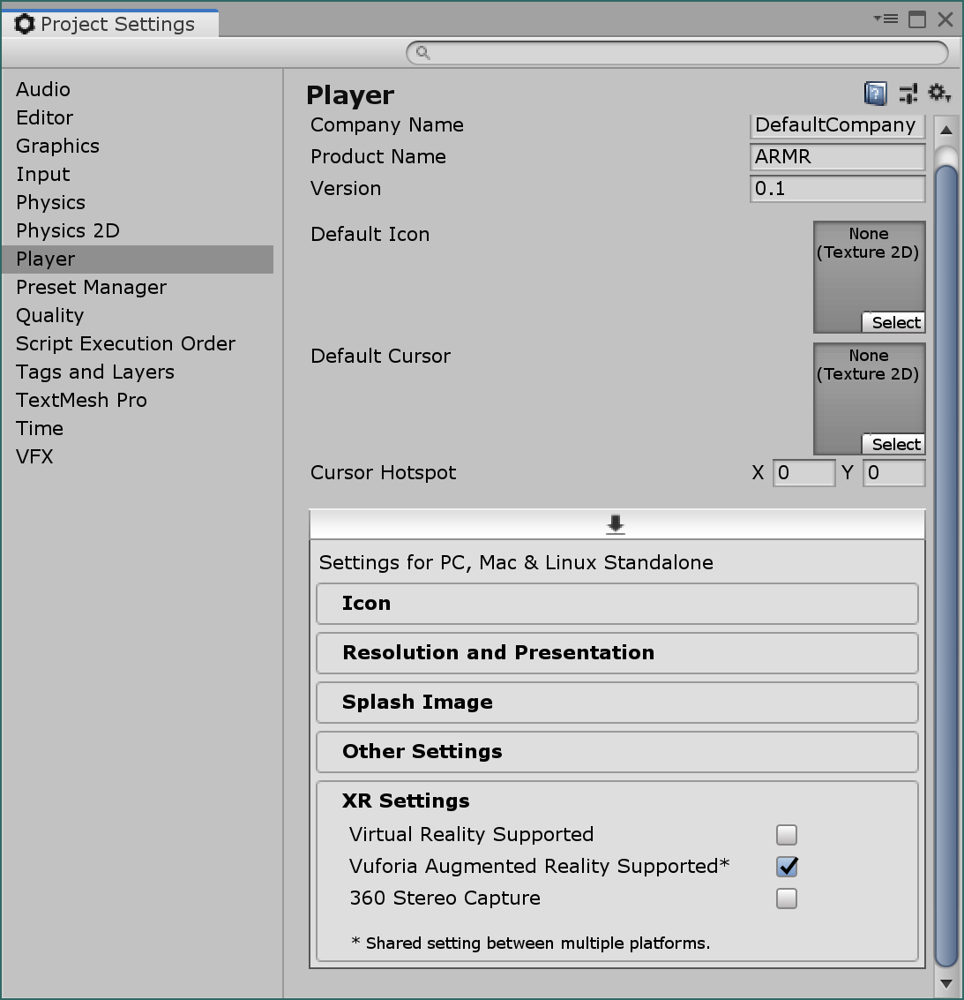
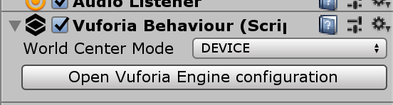
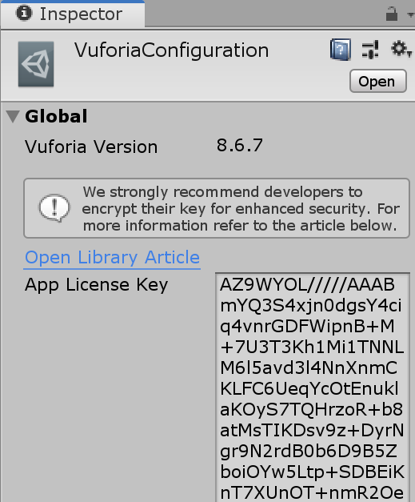
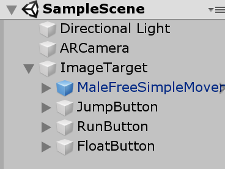
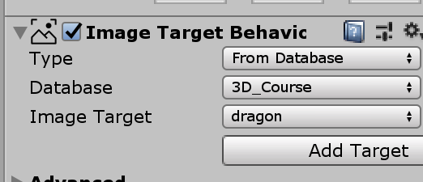
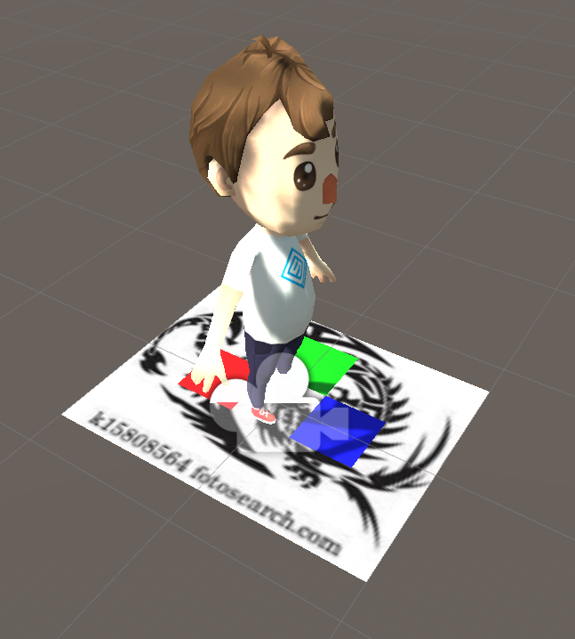
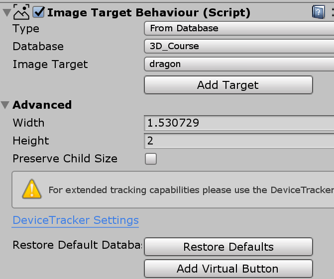
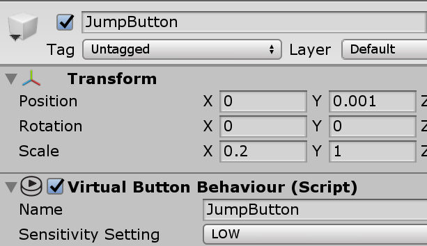
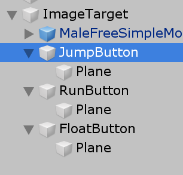

# AR/MR 虚拟按键小游戏

视频地址：https://github.com/huanghongxun/3D-Programming-And-Design/tree/master/homework10/ARMR/spotlight.mp4

优酷：https://v.youku.com/v_show/id_XNDQ4Mjc4ODUyNA==.html?spm=a2h3j.8428770.3416059.1

## 截图



## 实验步骤

### 启用 Vuforia

我们需要启用 Vuforia AR 引擎以便使用 ARCamera 等组件：

在 File -> Build Settings -> Player Settings... -> Player -> XR Settings -> Vuforia AR Supported 勾选可启用 AR 引擎



### 图片识别与建模

利用 Vuforia 建立图片识别模型可以参考 https://pmlpml.github.io/unity3d-learning/12-AR-and-MR 配置

### 添加 ARCamera

我们需要先删除原来的 Main Camera，并创建 AR Camera。创建后需要导入网站上提供的许可证。

在场景中创建了 ARCamera 后在 Inspector 面板中选择 Open Vuforia Engine configuration



并在新界面中粘贴 https://developer.vuforia.com 提供的开发用许可证



即可真正启用 Vuforia AR 引擎

### 创建 Image Target

我们直接在场景中添加一个 Image Target，创建后的游戏对象结构如下：



在导入 Vuforia 上产生的 Database 之后，我们需要在 Image Target 中设置使用我们到出的 Database：



可以看见，我们选择了 3D_Course 中的 dragon 图作为图片识别特征信息。

我们为了实现作业，我选择制作一个控制小人的 AR 游戏。

我们需要将小人的模型直接添加为 ImageTarget 的子游戏对象，如上图，小人游戏对象名称为 MaleFreeSimpleMovement1。结果如下：



可以看见场景中的 ImageTarget 已经将我们预先设置的图片显示了出来，说明导入成功。

#### 小问题

我一开始导入后 ImageTarget 显示为粉色图片。这是 Vuforia 安装的问题，不能安装 Vuforia 给 Unity 提供的 HoloLens 开发人员套件，重新安装 Unity 并仅直接导入 Vuforia 的 Unity Package 后解决了问题。

### 虚拟按钮

在 Image Target 的 Inspector 面板中添加虚拟按钮：



并同时设置虚拟按钮的名称以备代码调用



为每个虚拟按钮添加一个 Plane 以展示虚拟按钮的位置



选择 Plane 的理由是虚拟按钮根据图片的特征信息判断是否被触碰，那么图片的一个区域仅仅是一个平面而已，因此不需要 3D 模型描述。

接着为 ImageTarget 添加脚本如下：

```csharp
using UnityEngine;
using Vuforia;

public class ImageTargetController : MonoBehaviour
{
    public GameObject anime;
    private bool floating = false;
    private bool running = false;

    // Start is called before the first frame update
    void Start()
    {
        var animator = anime.GetComponent<Animator>();
        foreach (var virtualButton in GetComponentsInChildren<VirtualButtonBehaviour>())
        {
            virtualButton.RegisterOnButtonPressed(vb =>
            {
                switch (vb.VirtualButtonName)
                {
                    case "FloatButton":
                        animator.SetBool("Float", floating = !floating);
                        Debug.Log("Floating: " + floating);
                        break;
                    case "JumpButton":
                        animator.SetTrigger("Jump");
                        Debug.Log("Jump");
                        break;
                    case "RunButton":
                        running = !running;
                        animator.SetFloat("MoveSpeed", running ? 10 : 0);
                        Debug.Log("Running: " + running);
                        break;
                }
            });
        }
    }
}
```

我为每个 VirtualButton 设定了一个触发小人动画的动作。这样按下按钮即可触发小人跳跃、跑步、浮空。