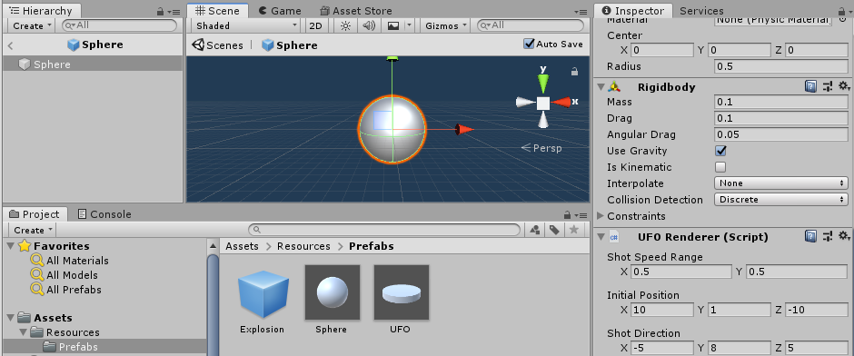

# 简单的鼠标打飞碟（Hit UFO）游戏

用 Unity 实现的游戏，采用纯代码生成所有游戏对象的方法构建游戏。

游戏采用 MVC 模式编写。

## 飞碟游戏

### 视频

[优酷视频](https://v.youku.com/v_show/id_XNDM4ODM2ODkwOA==.html?spm=a2h3j.8428770.3416059.1)

[视频下载地址](https://github.com/huanghongxun/3D-Programming-And-Design/tree/master/homework4/Hit-UFO/Hit-UFO.mp4)

### 规则

1. 一轮 10 秒，第 i 轮发射 i 个飞碟
2. 有圆盘和圆球两种飞碟
3. 点击飞碟得分，圆球得分少，圆盘得分多，颜色不同得分不同
4. 飞碟落地不得分
5. 随着游戏进行，飞碟移动距离和速度都将变大，移动距离和速度在范围内随机
6. 若第 i 轮没有拿到 i 分则失败

### 代码

#### Action

1. `ExplodeAction`：触发游戏对象爆炸的动作
2. `TipAction`：游戏对象上方显示分数的动作

#### Controller

1. `Entity`：Controller 的基类，处理点击事件
2. `EntityFactory`：负责创建 `Entity`
3. `GameController`：游戏控制器，负责联系游戏进程 `Game` 和 GUI `GuiIngame`
4. `UFO`：飞碟的控制器，管理飞碟的点击事件，并控制飞碟的模型和颜色
5. `EntityController`：监听点击事件，并发给 `Entity`
6. `SSDirector`：控制场景变换

#### Model

1. `Game`：负责控制游戏进程
2. `Ruler`：裁判类，负责控制一轮游戏的进程
3. `UFOModel`：飞碟，处理飞碟的飞行轨迹、速度，以及爆炸和提示得分

#### View

1. `GuiIngame`：显示轮次、得分、剩余飞碟数
2. `EntityRenderer`：游戏对象视图类的基类
3. `EntityRendererFactory`：负责游戏对象的创建和回收
4. `UFOEditor`：实现 `Component` 需求：自定义飞碟属性界面
5. `UFORenderer`：负责绘制飞碟，包括创建和回收飞碟游戏对象

### 游戏对象回收

`EntityRendererFactory` 负责游戏对象的创建和回收。创建 `Entity` 时，`EntityFactory` 会先请求 `EntityRendererFactory.CreateGameObject` 创建 `Entity` 所需的游戏对象（视图），此时 `EntityRendererFactory` 将会根据预设创建新游戏对象或复用已有的游戏对象。当飞碟爆炸时，飞碟将会调用 `EntityRendererFactory.Collect` 回收游戏对象，此时会清除游戏对象的 `Renderer` 和 `Controller`，并且将游戏对象禁用。

```csharp
public class EntityRendererFactory : Singleton<EntityRendererFactory>
{
    private Dictionary<string, GameObject> prefabs = new Dictionary<string, GameObject>();
    private Dictionary<string, Queue<GameObject>> objects = new Dictionary<string, Queue<GameObject>>();
    
    public TRenderer CreateGameObject<TRenderer>(string path)
        where TRenderer : EntityRenderer
    {
        GameObject obj;
        if (objects.TryGetValue(path, out Queue<GameObject> q) && q.Count > 0)
        {
            obj = q.Dequeue();
        }
        else
        {
            GameObject prefab;
            if (!prefabs.TryGetValue(path, out prefab))
                prefabs.Add(path, prefab = Resources.Load<GameObject>(path));
            obj = Instantiate(prefab);
        }
        obj.SetActive(true);

        EntityRenderer entityRenderer = obj.GetComponent<EntityRenderer>();
        TRenderer renderer;
        if (entityRenderer is TRenderer tRenderer)
        {
            renderer = tRenderer;
        }
        else
        {
            Destroy(entityRenderer);
            renderer = obj.AddComponent<TRenderer>();
        }
        renderer.OnSpawn();
        renderer.PrefabPath = path;
        return renderer;
    }

    public void Collect(GameObject obj)
    {
        EntityRenderer renderer = obj.GetComponent<EntityRenderer>();
        if (!renderer)
        {
            Destroy(obj);
            return;
        }
        obj.transform.parent = null;
        renderer.OnCollect();
        obj.SetActive(false);
        if (!objects.ContainsKey(renderer.PrefabPath))
            objects.Add(renderer.PrefabPath, new Queue<GameObject>());
        objects[renderer.PrefabPath].Enqueue(obj);
    }
}
```

### 飞碟发射

`UFOModel` 类负责处理飞碟的发射行为，作为 `Model` 层，`UFOModel` 只处理飞碟的移动数据、物理引擎计算。

```csharp
public class UFOModel : Model
{
    public int score { get; set; }

    public Ruler game { get; set; }

    public bool success { get; set; } = false;

    public void OnShot()
    {
        success = true;
        game.AddScore(score);
        ExplodeAction.StartExplodeAction(gameObject.GetComponent<Rigidbody>().position);
        EntityRendererFactory.Instance.Collect(gameObject);
    }

    public Rigidbody Send(Vector3 initialPosition, Vector3 initialDirection, float speed)
    {
        gameObject.transform.position = initialPosition;

        Rigidbody rigidbody = gameObject.GetComponent<Rigidbody>();
        rigidbody.AddForce(initialDirection * speed, ForceMode.Impulse);
        return rigidbody;
    }
}
```

### 裁判类

裁判类负责控制每一轮游戏的进程。在该轮内，裁判类将会倒计时，并定时发射新的飞碟（当然对象可能是回收的），检查飞碟是否坠落，负责统计得分。

```csharp
public class Ruler
{
    private readonly int round;
    private readonly Game game;
    private float time = 0;

    public int Trial { get; private set; }

    public int MaxTrial { get; private set; } = 10;

    public int Score { get; private set; }

    public Ruler(Game game, int round)
    {
        this.game = game;
        this.round = round;
        this.Trial = this.MaxTrial = round;
        this.time = 10f / MaxTrial;
        this.Score = 0;
    }

    public void SendUFO()
    {
        var ufo = new UFOModel
        {
            score = Random.Range(1, 5),
            game = this
        };
        UFO ufoEntity = UFO.Factory.Instance.Instantiate(ufo);
        ufoEntity.gameObject.transform.parent = game.transform;

        float speed = 0.1f;
        for (int i = 1; i < round; ++i) speed *= 1.1f;

        float actualSpeed = Random.Range(speed, speed * 1.3f);
        Rigidbody body = ufo.Send(ufoEntity.renderer.initialPosition, ufoEntity.renderer.initialDirection, actualSpeed);
        // body.AddTorque(new Vector3(1, 0, 0) * 20);
    }

    public void Update()
    {
        time += Time.deltaTime;
        while (time >= 10f / MaxTrial && Trial > 0)
        {
            Trial--;
            time -= 10f / MaxTrial;
            SendUFO();
        }

        foreach (var ufo in game.GetComponentsInChildren<UFO>())
        {
            if (!ufo.model.success && ufo.transform.position.y < 0)
                EntityRendererFactory.Instance.Collect(ufo.gameObject);
        }

        if (Trial <= 0 && game.GetComponentsInChildren<UFO>().Length == 0)
        {
            if (Score < round)
            {
                Debug.Log(this.GetHashCode());
                game.RoundLose();
            }
            else
            {
                game.RoundWin();
            }
        }
    }

    public void AddScore(int score)
    {
        Debug.Log(this.GetHashCode());
        this.Score += score;
    }
}
```

## 自定义 Component

对于飞碟游戏中的飞碟，我们可以创建不同的预设从而得到不同的飞碟设置，这样不同得分的飞碟的外观就很可能不同。为此我们需要制作 Unity 中 Inspector 的 `EditorGUI`。

根据文档，我们可以创建 `UFOEditor` 类如下：

```csharp
[CustomEditor(typeof(UFORenderer))]
public class UFOEditor : Editor
{
    public override void OnInspectorGUI()
    {
        var target = (UFORenderer)serializedObject.targetObject;

        EditorGUILayout.Space();
        Vector2 result = EditorGUILayout.Vector2Field("Shot Speed Range", new Vector2(target.speedMultiplierMin, target.speedMultiplierMax));
        target.speedMultiplierMin = result.x;
        target.speedMultiplierMax = result.y;

        EditorGUILayout.Space();
        target.initialPosition = EditorGUILayout.Vector3Field("Initial Position", target.initialPosition);

        EditorGUILayout.Space();
        target.initialDirection = EditorGUILayout.Vector3Field("Shot Direction", target.initialDirection);
    }
}
```

