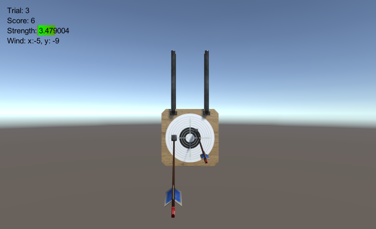

## 打靶游戏

### 规则

1. 靶对象为 5 环，按环计分；
2. 箭对象，射中后要插在靶上
   * **增强要求**：射中后，箭对象产生颤抖效果，到下一次射击 或 1秒以后 
3. 游戏仅一轮，无限 trials；
   - **增强要求**：添加一个风向和强度标志，提高难度

### 代码

#### Action

1. `TipAction`：游戏对象上方显示分数的动作
2. `ShakeAction`：箭的颤抖动作

#### Controller

1. `Entity`：Controller 的基类，处理点击事件
2. `EntityFactory`：负责创建 `Entity`
3. `GameController`：游戏控制器，负责联系游戏进程 `Game` 和 GUI `GuiIngame`
4. `Arrow`：箭的控制器，接收箭的碰撞事件
5. `SSDirector`：控制场景变换

#### Model

1. `Game`：负责控制游戏进程
2. `Ruler`：裁判类，负责控制一轮游戏的进程
3. `ArrowModel`：箭，处理箭的飞行轨迹、速度、处理碰撞、瞄准

#### View

1. `GuiIngame`：显示轮次、得分、剩余飞碟数
2. `EntityRenderer`：游戏对象视图类的基类
3. `EntityRendererFactory`：负责游戏对象的创建和回收
4. `ArrowRenderer`：负责绘制箭，包括创建和回收箭游戏对象

## 颤抖

箭对象的颤抖很好做，通过 `transform.RotateAround` 方法就可以实现箭围绕箭头尖的坐标旋转。接下来的问题就是旋转角的函数了，经过尝试，我找到了这个函数：

$$ angle(t)=0.4^t\sin(s\log(t+1)) $$

其中，$s$ 为颤抖力度参数，$s$ 越大，颤抖频率越高，$t$ 为时间。函数图像如下：


可以看到旋转角随时间颤抖幅度越来越小，而且周期越来越长，最后趋于 0。

```csharp
time += Time.deltaTime;
if (time > duration) time = duration;
transform.localPosition = position;
transform.localRotation = rotation;

if (time >= duration)
{
    Destroy(this);
}
else
{
    transform.RotateAround(center, axis, angle * Mathf.Pow(0.4f, time) * Mathf.Sin(Mathf.Log(time + 1) * speed));
}
```

同时，我将角度和频率与箭发射力度关联了起来，箭速度越快，角度越大，频率越高。

```csharp
gameObject.AddComponent<ShakeAction>().Shake(point, Vector3.up, duration: 3.92f, speed: strength * 10, angle: strength / 20f + 0.5f);
```

### 截图

左上角为游戏信息，其中 Wind 为风力方向。



### 视频

[优酷视频](https://v.youku.com/v_show/id_XNDQwMjIzNzQ3Ng==.html?spm=a2h3j.8428770.3416059.1 )
[视频下载地址](https://github.com/huanghongxun/3D-Programming-And-Design/tree/master/homework5/Targeting-Game/record.mp4)