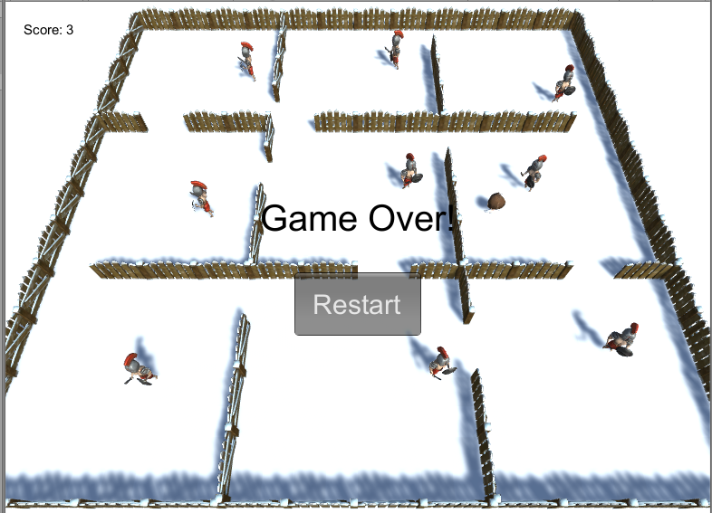
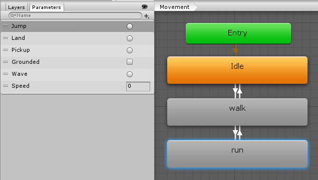
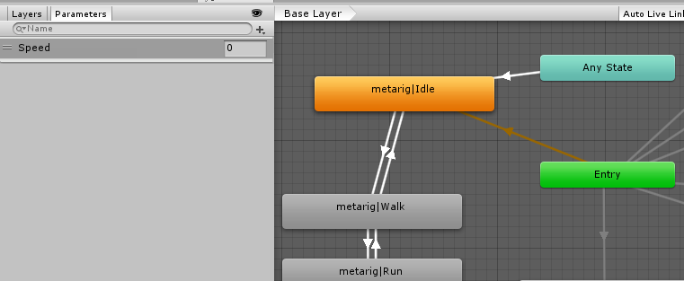

# 模型与动画

用 Unity 实现的游戏，采用纯代码生成所有游戏对象的方法构建游戏。

游戏采用 MVC 模式编写。

## 巡逻兵

### 视频



[优酷视频](https://v.youku.com/v_show/id_XNDQyMzY3MDk4OA==.html?spm=a2hzp.8244740.0.0 )

[视频下载地址](https://github.com/huanghongxun/3D-Programming-And-Design/tree/master/homework6/Patrol/spotlight.mp4)

### 代码

#### Action

1. `TraceAction`：对象追踪其他对象的动作，用于敌人追赶玩家
3. `MoveAction`：位移动作，用于敌人巡逻

#### Controller

1. `Entity`：Controller 的基类，处理点击事件
2. `EntityFactory`：负责创建 `Entity`
3. `GameController`：游戏控制器，负责联系游戏进程 `Game` 和 GUI `GuiIngame`
4. `Enemy`：敌人的控制器，管理敌人的追踪和巡逻状态
5. `Region`：片区，一个敌人在一个片区内巡逻
6. `Player`：玩家的控制器，接收玩家的键盘事件进行移动
7. `EntityController`：监听点击事件，并发给 `Entity`
8. `SSDirector`：控制场景变换

#### Model

1. `Game`：负责控制游戏进程
2. `Ruler`：裁判类，负责控制一轮游戏的进程，创建敌人、片区、玩家、场景
3. `EnemyModel`：敌人，处理敌人的运动轨迹和运动状态
4. `PlayerModel`：玩家，处理玩家与敌人碰撞的事件
5. `RegionModel`：片区，处理与玩家的碰撞事件，从而触发敌人追踪行为

#### View

1. `GuiIngame`：显示轮次、得分、剩余飞碟数
2. `EntityRenderer`：游戏对象视图类的基类
3. `EntityRendererFactory`：负责游戏对象的创建和回收

### 动画

#### 玩家

以下是玩家的动画模型，通过 Speed 大小来控制是在停止、步行还是跑步状态



那么如果玩家按下键盘的 WASD 键，就通过修改 Parameter 来实现移动：

```csharp
if (movement != Vector3.zero)
{
    GetComponent<Animator>().SetInteger("Speed", 10);
}
else
{
    GetComponent<Animator>().SetInteger("Speed", 0);
}
```

#### 敌人

以下是敌人的动画模型，通过 Speed 大小来控制是在停止、步行还是跑步状态



通过区分是否有目标，来查看敌人需要巡逻或者追逐：

```csharp
if (!target)
{
    // 敌人巡逻时使用走路的动画
    gameObject.GetComponent<Animator>().SetInteger("Speed", 3);
}
else
{
    // 敌人追赶玩家时使用跑步的动画
    gameObject.GetComponent<Animator>().SetInteger("Speed", 7);
}
```

### 碰撞

#### 进入片区

通过碰撞来实现检查玩家是否进入指定区域，以下是片区 Region 类的部分代码：

```csharp
public void OnTriggerEnter(Collider collider)
{
    if (collider.gameObject.tag == "Player")
    {
        model.OnCollisionWithPlayer(collider.gameObject);
    }
}
```

#### 撞到敌人

如果被敌人追上，则会触发碰撞：

```csharp
public void OnCollisionEnter(Collision collision)
{
    if (collision.gameObject.tag == "Enemy")
    {
        model.OnCollisionWithEnemy(collision.gameObject);
    }
}
```

### 动作

通过 `Action` 类，可以很好地实现代码的复用与模块化。

#### `TraceAction` 

该类负责敌人追逐的动作：

```csharp
void Update()
{
    transform.position = Vector3.MoveTowards(transform.position, target.transform.position, speed * Time.deltaTime);

    transform.rotation =
        Quaternion.LookRotation(target.transform.position - gameObject.transform.position, Vector3.up);
}
```

#### `MoveAction`

该类负责巡逻时的两点间移动：

```csharp
public override void UpdateAction()
{
    time += Time.deltaTime;
    if (time >= Duration) time = Duration;
    Vector3 rel = (target - source) * (time / Duration);
    Vector3 newPosition = source + rel;
    if (local)
    {
        transform.localPosition = newPosition;

        transform.localRotation =
            Quaternion.LookRotation(target - source, Vector3.up);
    }
    else
    {
        transform.position = newPosition;

        transform.rotation =
            Quaternion.LookRotation(target - source, Vector3.up);
    }
    if (time >= Duration)
    {
        Action?.Invoke(this, EventArgs.Empty);
        RequestDestroy();
    }
}
```

### 初始化地图

为了创建一个五边形的移动轨迹，我们可以在圆上选择 5 个点来确保多边形。我们可以借助原来的工厂模式代码来生产和复用巡逻兵。

```csharp
for (var i = -1; i <= 1; ++i)
for (var j = -1; j <= 1; ++j)
{
    var center = new Vector3(i * 8, 0, j * 8);
    var obj = Region.Factory.Instance.Instantiate(new RegionModel
    {
        game = this,
        score = 1,
        x = i,
        y = j
    });
    obj.transform.position = center;
    obj.transform.parent = root.transform;
    enemies[i + 1, j + 1] = Enemy.Factory.Instance.Instantiate(new EnemyModel
    {
        score = 1,
        speed = 1,
        // 通过在圆上随机选择 5 个点来构造一个凸五边形
        points = new Queue<Vector3>(Enumerable
            .Repeat(0, 5)
            .Select(x => Random.Range(0, 360))
            .OrderBy(x => x)
            .Select(angle => center + Quaternion.AngleAxis(angle, Vector3.up) * Vector3.forward * 3)
            .ToArray())
    });
    enemies[i + 1, j + 1].Wander();
    enemies[i + 1, j + 1].transform.parent = root.transform;
}
```

### 发布订阅模式

C# 的事件注册刻意很容易地实现发布订阅模式。

玩家进入片区后，片区通过 `OnTriggerEnter` 方法获知该行为，通过事件将该行为通知出去：

```csharp
public void OnCollisionWithPlayer(GameObject gameObject)
{
    Collision?.Invoke(this, new Vector2Int(x, y));
}
```

这样游戏管理器就可以通过注册事件来监听该行为，避免片区模型 RegionModel 类依赖游戏管理器 Ruler 类。

```csharp
obj.model.Collision += (sender, index) => {
    Trace(index.x, index.y);
    AddScore(1);
};
```