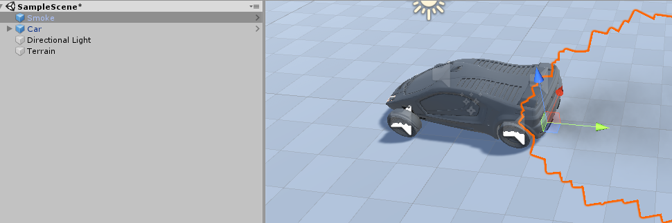
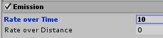
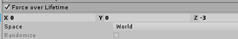
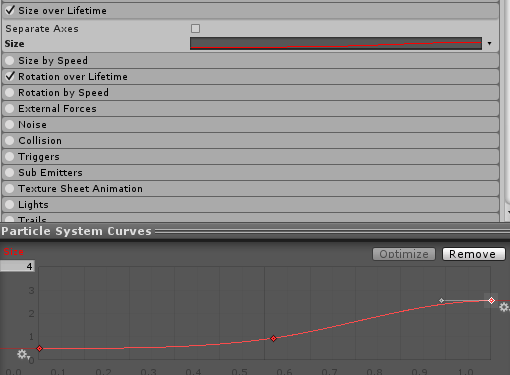
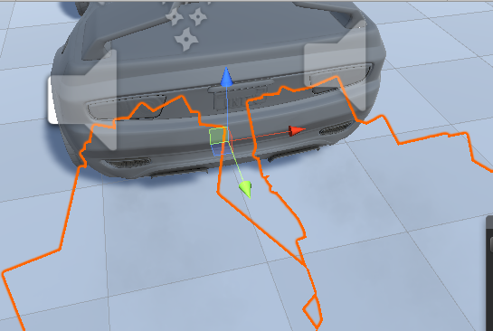

# 粒子系统

[视频下载链接](https://github.com/huanghongxun/3D-Programming-And-Design/tree/master/homework7/Particle/spotlight.mp4)


## 汽车尾气模拟

### 创建粒子系统

根据官方教程，导入 Standard Assets 中的 Car 和 Smoke 如下：



我们可以调整烟雾的 Emission 的 RateOverTime 来调整烟雾的浓度，来实现汽车普通情况和故障情况下烟雾浓度的不同：



可以通过调整 Force Over LifeTime 来设置烟雾的方向、速度和传播距离，通过调整该项可以让烟雾间断喷出，形成故障效果



选中 Size Over LifeTime 的 Curve，可以调整烟雾的半径，从而让”尾气“半径符合汽车的排气孔大小：



最终效果如下：



### 碰撞和模拟故障

通过添加碰撞脚本 CarCollision：

```
public float damage = 0;
public ParticleSystem smokeLeft;
public ParticleSystem smokeRight;

void OnCollisionEnter(Collision collision)
{
	damage += gameObject.GetComponent<Rigidbody>().velocity.magnitude;
}

void UpdateSmoke(ParticleSystem smoke)
{
    var color = smoke.colorOverLifetime;
    var gradient = new Gradient();
    gradient.SetKeys(
    new[] { new GradientColorKey(Color.black, 0), new GradientColorKey(Color.gray, 0.5f), new GradientColorKey(Color.white, 1) },
    new[] { new GradientAlphaKey(0, 0), new GradientAlphaKey(Math.Min(damage + 10, 30) / 30f, 0.5f), new GradientAlphaKey(0, 1) });
    color.color = gradient;
}

void Update()
{
    UpdateSmoke(smokeLeft);
    UpdateSmoke(smokeRight);
}

void OnGUI()
{
	GUI.Label(new Rect(5, 5, 1000, 20), "Damage: " + damage);
}
```

我们可以检查车辆的损坏状况并修改烟雾的浓度和颜色来实现损坏模拟