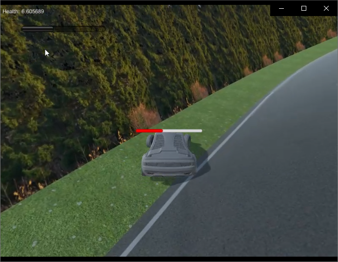
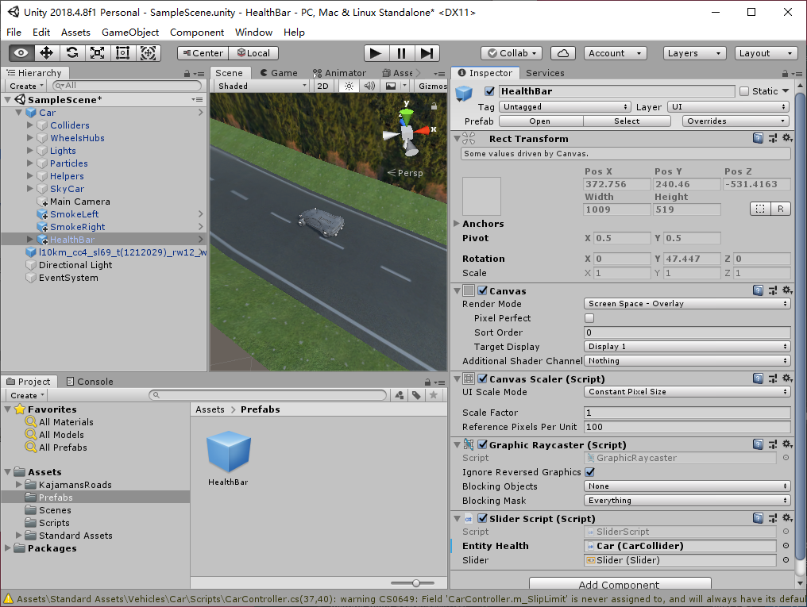

# 血条

[视频下载链接](https://github.com/huanghongxun/3D-Programming-And-Design/tree/master/homework8/HealthBar/spotlight.mp4)



[优酷](https://v.youku.com/v_show/id_XNDQ0NDM5NTUyNA==.html?spm=a2h3j.8428770.3416059.1 )

## 问题

血条（Health Bar）的预制设计。具体要求如下

- 分别使用 IMGUI 和 UGUI 实现
- 使用 UGUI，血条是游戏对象的一个子元素，任何时候需要面对主摄像机
- 分析两种实现的优缺点
- 给出预制的使用方法

## IMGUI 实现

借助 `GUI.HorizontalScrollbar` 实现渲染进度条来表达血条

优点：IMGUI 接口简单易用

缺点：IMGUI 代码编码不直观，修改调试困难；借助 IMGUI 实现的血条是二维渲染在屏幕上的，不能跟随汽车晃动；缺少方便的设计工具

```csharp
using System.Collections;
using System.Collections.Generic;
using UnityEngine;

public class IMGUI : MonoBehaviour
{
    public EntityHealth entityHealth;
    private float displayHealth;

    void Start()
    {
        displayHealth = entityHealth.health;
    }

    void OnGUI()
    {
        displayHealth = Mathf.Lerp(displayHealth, entityHealth.health, 0.05f);

        GUI.HorizontalScrollbar(new Rect(50, 50, 200, 20), 0.0f, displayHealth / entityHealth.maxHealth, 0, 1);
    }
}
```

## UGUI 实现

借助 Slider 来渲染血条，借助 Slider 实现的血条能和汽车绑定，不受视角变化的影响

优点：拥有设计工具，所见即所得；允许设计师参与游戏 UI 开发，减少了程序员的工作量，加快了游戏开发速度；面向对象编程

缺点：UGUI 渲染效率要低于 IMGUI

```csharp
using UnityEngine;
using UnityEngine.UI;

public class SliderScript : MonoBehaviour
{
    public EntityHealth entityHealth;
    private float displayHealth;
    public Slider slider;

    void Start()
    {
        displayHealth = entityHealth.health;
    }

    void Update()
    {
        displayHealth = Mathf.Lerp(displayHealth, entityHealth.health, 0.05f);

        slider.value = displayHealth / entityHealth.maxHealth;
    }
}
```

### 预置使用方法

拖入 HealthBar 预置到 Car 的子 GameObject，并设置 Slider Script 的 EntityHealth 为 Car 即可。

