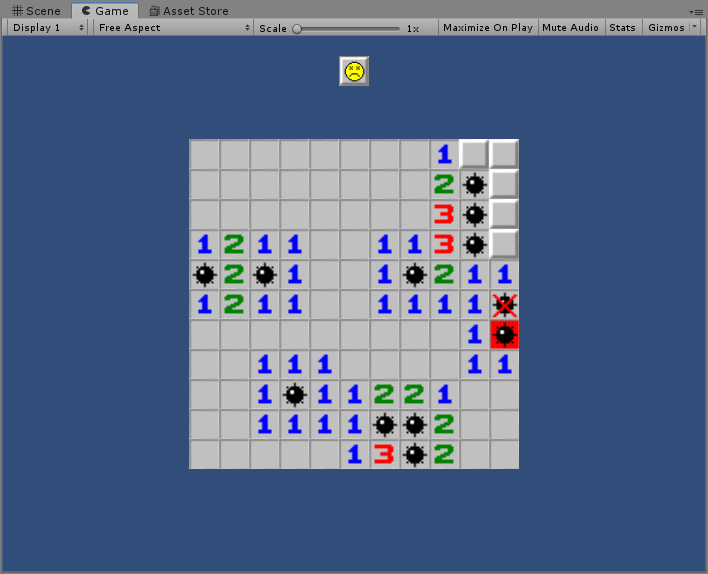

# MineSweeper
用 Unity 和 GUI 类实现的扫雷游戏。

请注意，当你在打开 Unity 项目的时候，必须先选中 MainMenuScene 才能加载出主场景。

## Screenshots

## Spotlight

这个是演示视频，您可以下载下来查看

https://github.com/huanghongxun/3D-Programming-And-Design/blob/master/minesweeper/spotlight.mp4

## 游戏实现

### UML 结构图

### GuiComponent

`GuiComponent` 为所有 2D 元素的基类，因此按钮、计时器、数字显示屏、棋盘都是 `GuiComponent` 的派生类。

游戏全部使用 `IMGUI` 构建，由于 `IMGUI` 过于原始，我们需要自己封装 `Gui` 类来帮助我们完成工作。

`GuiComponent` 本身使用了**组合模式**，每个 `GuiComponent` 有自己的孩子，每个孩子的定位相对于父组件定位，最后组件形成了组件树。

### GuiTileBoard

`GuiTile` 为棋盘的每一个方块，并维护方块当前状态是未被揭开、已经揭开、插旗等。还负责自己的点击事件的处理。

`GuiTileBoard` 实现了游戏的逻辑，负责计算当前局面是胜利还是失败。`GuiTileBoard` 每次都会查询所有的 `GuiTile` 并维护当前局面形势。